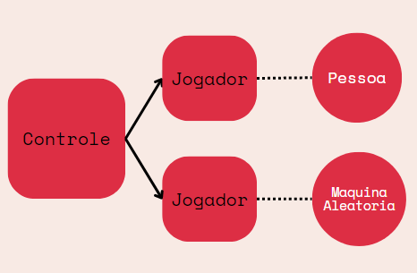

# Apresentação do Projeto

# Projeto `Super Ludo`

# Descrição Resumida do Projeto/Jogo

> Trata-se de uma adaptação do jogo Ludo, com alguns incrementos. O objetivo é dar a volta no tabuleiro com todas suas 4 peças, movimentando-as de acordo com o número dos dados. A dificuldade encontra-se que se uma peça adversária cair na mesma célula que a sua, sua peça é comida e deve retornar a base, recomeçando todo o percurso. Analogamente, você também pode comer peças inimigas. Pode-se jogar com os amigos de 2, 3 ou 4 pessoas, ou também pode-se jogar contra algum dos bots (aleatório, rápido, inteligente). Ganha quem completar o objetivo primeiro. Mais detalhes das regras do jogo ou do funcionamento dos bots pode ser encontrado [aqui](src/README.md).

# Equipe
* `Clara Mattos Medeiros` - `247021`
* `Isabella Ribeiro Rigue` - `234618`

# Arquivo Executável do Jogo

> [Download do arquivo `jar`](https://drive.google.com/drive/folders/1vZNI6-ut1LBfrGpc2ON8SOH63SQvFVtF?usp=sharing)
> 
obs: 
> - rodar o executável na mesma pasta que a pasta assets
> - há um executável específico para os sistemas Linux, pois nesse caso o caminho das imagens deve ser alterado no código (de '\\' para '/') nas classes Peca e ViewGrafico

# Slides do Projeto

## Slides da Prévia
> [Proposta inicial do jogo](https://docs.google.com/presentation/d/12rV_AdN4QFR2ecZaUHOLwGJCzaUigwPXL5O03V0YcQ4/edit#slide=id.p)

## Slides da Apresentação Final
> [Apresentação Final](https://www.canva.com/design/DAFE2J06abs/lrU3FeykeHoHeoiFLIUH_Q/view?utm_content=DAFE2J06abs&utm_campaign=designshare&utm_medium=link&utm_source=publishsharelink)

## Relatório de Evolução

Inicialmente, a proposta do grupo foi programar o jogo Ludo na sua forma tradicional. Entretanto, rapidamente nos deparamos com o desafio de evitar que o trabalho se tornasse algo raso e sem originalidade, uma vez que o jogo Ludo já existe e sua complexidade não é alta. Uma saída pensada pelo grupo foi, portanto, implementar bots no jogo, criando um diferencial para o projeto. Dessa forma, foram pensados os 3 bots que seriam implementados e cada um foi cautelosamente arquitetado para que o usuário tivesse uma experiência mais rica e divertida quando jogasse. 

Uma vez com o projeto definido, o primeiro escopo de código feito foi o construtor da classe Tabuleiro, seguido da construção de cada célula presente nele (classe CelulaFactory), uma vez que esses componentes são a base do jogo. Para isso, foram feitos desenhos e rascunhos, em papel, para mapear a posição de cada casa, base de cada cor e célula especial, e entender melhor o comportamento do tabuleiro do Ludo. Como o trajeto feito pelas peças (cujo formato assemelha-se com uma cruz) é específico, decidimos por conectar as células via atributos int proximaX, proximaY, anteriorX e anteriorY. Dessa forma, ao construir o tabuleiro, cada célula tinha as informações sobre as coordenadas da sua célula seguinte e anterior, e percorrer tal tabuleiro tornou-se uma tarefa simplificada. 

	Além disso, na construção das células, é importante ressaltar que cada cor tem o seu próprio percurso. Isto é: o amarelo percorre a pista de entrada amarela (casas amarelas do meio do mapa que levam para a vitória da peça) no final do percurso, e as outras cores não podem ter acesso a essas casas. Para isso ocorrer, as quatro casas do tabuleiro que antecedem as quatro pistas de entradas (visualmente, as casas pontas da cruz) tem como atributo proximaX e proximaY o número -1. Dessa forma, sempre que uma peça andar, verifica-se se a próxima casa é (-1,-1) e, caso positivo, é chamada uma função que retorna  a próxima célula a ser visitada, de acordo com a cor da peça que irá andar. 

	Finalizada a construção de todos os componentes do jogo e as partes fundamentais do código, como a função que move uma peça, um grande obstáculo enfrentado pelo grupo foi a construção de uma interface gráfica, tornando visual tudo o que havia sido programado. Inicialmente tentamos implementar a biblioteca libGDX mas, após esforços falhos para compreender e aplicar tal ferramenta, optamos por utilizar a biblioteca JavaSwing, própria do Java, que consideramos mais intuitiva e de fácil manuseio. 

	Outra dificuldade enfrentada pela dupla foi corrigir os inúmeros bugs que apareciam quando a maior parte do programa já havia sido finalizada. Isso porque os bugs eram, muitas vezes, condicionais e específicos. Como exemplo, temos um bug que encontramos quando uma peça número X passava por uma casa que já havia uma peça desse mesmo número, mas de um outro jogador. Nesse cenário, o bug era que a peça do outro jogador tornava-se imóvel e inexistente para o jogo. Uma vez encontrado, entretanto, devíamos reproduzir esse mesmo cenário no jogo, várias vezes, para entender o que estava acontecendo até que o bug fosse entendido e resolvido. Entretanto, o Ludo é um jogo que envolve sorte e, muitas vezes, custava tempo e esforço até que fosse possível reproduzir cenários específicos, o que fez com que os acabamentos finais realizados pelo grupo demorassem.

	Finalmente, com o projeto já finalizado, levantamos a curiosidade de entender quão eficazes são as estratégias implementadas por cada bot. Para quantificar esses dados, cada conjunto de bots diferentes se enfrentou e reunimos as estatísticas de 25 jogos. Quando o Bot Rápido enfrenta o Bot Aleatório, o Bot Aleatório ganha 64% dos jogos. Já quando o Bot Aleatório enfrenta o Bot Inteligente, o Bot Inteligente ganha 92% das vezes. Por fim, na disputa Bot Rápido e Bot Inteligente, o Bot Inteligente ganha 100% das vezes. Dessa forma, concluímos que o Ludo, apesar de ser um jogo que envolve sorte (haja vista as 2 vezes que o bot aleatório ganhou do bot inteligente, por exemplo) é majoritariamente estratégico.

# Destaques de Orientação a Objetos

# Conexões
## Diagrama de Classes usada no destaque OO:

## Código do Destaque OO
~~~java
public class Tabuleiro {
	private Celula[][] celulas;
	private ViewGrafico view;

    ...

	public void conectaView(ViewGrafico view) {
		this.view = view;
	}

	public ViewGrafico getView() {
		return view;
	}
}
~~~

> Para fazermos a arquitetura do jogo (mencionada em detalhes posteriormente), seguindo o modelo MVC, utilizamos conexões entre as classes. Portanto, implementamos métodos conecta para conectar os objetos necessários. No diagrama acima, é possível ver todas as conexões utilizadas, que serão melhor explicadas na seção de arquitetura.

# Encapsulamento

## Código do Destaque OO
~~~java
public class Peca extends JPanel implements Observed{
	private Tabuleiro tabuleiro;
	private boolean ganhou;
	private Image imagem;

    ...

	public Tabuleiro getTabuleiro() {
		return tabuleiro;
	}
	
	public Image getImage() {
		return imagem;
	}

	public boolean getGanhou() {
		return ganhou;
	}

	public void setGanhou(boolean ganhou) {
		this.ganhou = ganhou;
	}
}
~~~

> O encapsulamento garante a segurança do código, protegendo os atributos de acessos diretos. Além disso, facilita a manutenção e reuso do código. Para isso, colocamos os atributos como protegidos ou privados e utilizamos métodos getters and setters.

# Sobrecarga de métodos

## Código do Destaque OO
~~~java
public void atualizarView() { 
    //funcao para atualizar o view do dado qnd mudar o numero 
    view.updateUI();
}

public void atualizarView(Peca peca, int x, int y) {
    //funcao para atualizar o view qnd acontecer algum movimento da peca
    peca.update(x, y);
}
~~~

> Foram criados dois métodos com o mesmo nome, porém com parâmetros diferentes, caracterizando a sobrecarga. Um deles é para quando vamos atualizar a imagem do dado do jogo e o outro é para quando precisamos atualizar a imagem da peça se movendo. 

# Herança e sobreposição
## Diagrama de Classes usada no destaque OO:

## Código do Destaque OO
~~~java
public class Pessoa extends Jogador{
	private int option;

	public Pessoa(String cor, Tabuleiro tabuleiro) {
		super(cor, tabuleiro);
	}

	public void fazerJogada(int numDado) {
		super.fazerJogada(numDado);
    ...
		int size = pecasDisponiveis.size();
		this.option = 0; 

		if(size == 0) {
			String[] options = {"Continuar"};
    ...
    }
}
~~~
~~~java
public class MaquinaRapida extends Maquina{

    public MaquinaRapida(String cor, Tabuleiro tabuleiro) {
		super(cor, tabuleiro);
	}

    public void fazerJogada(int numDado) { 
        super.fazerJogada(numDado);
        if (qtdPecasDisponiveis != 0) { 
            mover(pecasDisponiveis.get(0), numDado);
        } else if (numDado == 1 || numDado == 6){
            mover(pecasBase.get(0), numDado);
        }
    }
}
~~~

> Trabalhamos bastante com o conceito de herança, uma vez que tínhamos classes bem parecidas, mas cada uma com algumas particularidades a mais. Como podemos ver no diagrama, Pessoa é herdeira de Jogador e MaquinaRapida é herdeira de Maquina (que é herdeira de Jogador), com isso todo Jogador tem o método fazerJogada, mas para cada caso há particularidades, então nessas classes o método é sobreposto, acrescentando mais ações de código.

# Polimorfismo
## Diagrama de Classes usada no destaque OO:

## Código do Destaque OO
~~~java
public class Controle {
	private Jogador jogador1, jogador2, jogador3, jogador4;
    ...
	public void criaJogadores() {
		if(modo == 1) {
			jogador1 = new Pessoa(corSelecionada(1), tabuleiro);
			jogadores.add(jogador1);
			if(bot == 0)
				jogador2 = new MaquinaAleatoria(corSelecionada(2), tabuleiro);
        ...
    }
}
~~~

> O conceito de polimorfismo foi bem explorado no decorrer do projeto. Por exemplo, na classe Controle, foram declarados 4 objetos da classe Jogador, mas que foram instanciados nas classes Pessoa ou Maquina, dependendo do caso.

# Destaques de Pattern
> Os padrões de projeto adotados pela equipe foram:

# Singleton
## Diagrama do Pattern

## Código do Pattern
~~~java
public class Tabuleiro {
	private Celula[][] celulas;
	private ViewGrafico view;
	private int numDado; 
	private static final Tabuleiro instance = new Tabuleiro();

	private Tabuleiro() {
        ...
	}
	
	public static Tabuleiro getInstance() {
		return instance;
	}
}
~~~

> Este padrão de projeto garante a existência de apenas uma instância de uma classe, tornando um acesso único para o objeto. No caso, adotamos isso para o Tabuleiro, uma vez que existe apenas um tabuleiro no jogo, então faz sentido ter apenas um ponto de acesso a ele, pois é um objeto único compartilhado por diferentes partes do programa. Como visto no diagrama, conectamos o controle e as peças com a instância do tabuleiro.

# Observer
## Diagrama do Pattern

## Código do Pattern
~~~java
public interface Observed {
    public void registrar(Observer obj);
    public void notificarObservadores();
}
~~~
~~~java
public interface Observer {
    public void update();
}
~~~
~~~java
public class Peca extends JPanel implements Observed {
    ...
	public void registrar(Observer obj) {
		if(!observers.contains(obj)) observers.add(obj);
	}

	public void notificarObservadores() {
		for (Observer obj : this.observers) {
			obj.update();
		}
	}
}
~~~
~~~java
public class ViewGrafico extends JPanel implements Observer {
    ...
    public void update() {
        updateUI();
        try {
            Thread.sleep(200);
        } catch(InterruptedException e) {};
    }
}
~~~

> O padrão Observer define um relacionamento de dependência entre n objetos. No nosso caso, colocamos a classe ViewGrafico como Observer e a classe Peca como Observed (Subject), implementando tais interfaces. Dessa forma, quando o objeto peça se mover, ele irá notificar seus observadores, que nesse caso será apenas a view, conforme diagrama, chamando seu método update. Com ele, a ViewGrafico irá atualizar a interface gráfica, mostrando a peça se movendo na tela. Cabe ressaltar que para fazer isso primeiramente registramos a view como observadora, com o método registrar. Esse padrão facilita a dependência entre os objetos e as atualizações que devem ser feitas, tornando o código mais lógico e limpo.

# Factory
## Diagrama do Pattern

## Código do Pattern
~~~java
public class CelulaFactory {
    public static Celula criarCelula(int i, int j) {
        Celula celula;
        if(i >= 2 && i <= 3 && j >= 2 && j <= 3) {
            celula = new Base("vermelho", i, j);
            celula.definirProxima(6, 1);
        } else if(i >= 2 && i <= 3 && j >= 11 && j <= 12) {
            celula = new Base("verde", i, j);
            celula.definirProxima(1, 8);
    ...
        } else if(i == 6 && (j <= 5 || j >= 9)) {
            if (j == 1)
                celula = new CelulaEstrela(i, j, "vermelho");
            else
                celula = new Celula("null", i, j);
    ...

        return celula;
    }
}
~~~

> Para fazer o jogo, criamos um tabuleiro que pode conter alguns tipos de célula diferentes (celula, base, celulaEstrela), dependendo da posição. Com isso, para deixar o código mais organizado, facilitar seu reuso e manutenção, além de ser mais lógico, adotamos o padrão Factory. A partir dele, foi feita a classe CelulaFactory que dada uma posição (i, j) do tabuleiro, ela já checa as condições necessárias e retorna a célula criada para aquela posição, já com o tipo adequado, vide código e diagrama acima. Logo, quando criamos o tabuleiro (que é uma matriz de células), chamamos o método criarCelula da classe CelulaFcatory para cada posição.

# Conclusões e Trabalhos Futuros

	Durante a confecção do jogo, houve pendências que não puderam ser solucionadas, seja por falta de tempo, complexidade alta ou organização de código mal planejada. Dessa forma, é grande o espaço para melhorias no projeto atual.

	Várias dessas pendências estão relacionadas com a interface visual, uma vez que o grupo teve dificuldade ao manusear a biblioteca JavaSwing e não houve tempo para implementar tudo o que se desejava. Como exemplos dessas possíveis melhorias na parte visual do projeto temos a adição de um gif que simulasse o dado rodando antes de ser jogado. Não descobrimos a tempo como adicionar um gif na biblioteca e, por tal motivo, o número sorteado aparece sem ser antecipado por qualquer animação. Outra melhoria que poderia ser implementada é a possibilidade de escolha de cor e de nome pelo jogador.

	Além disso, o projeto inicial propunha que o jogador pudesse utilizar o mouse para clicar na peça que deseja mover, e que todas as peças que pudessem ser movidas estivessem destacadas. Entretanto, o grupo não conseguiu implementar o clique com o mouse dessa forma com a biblioteca escolhida e, no projeto atual, uma janela se abre com as opções de peças a serem movidas para que o jogador clique na desejada.

	Uma pequena falha na programação da interface foi o acesso às imagens que a compõem. Isso porque as imagens devem ser recuperadas de alguma pasta e, no sistema operacional do Windows, o caminho de acesso para algum arquivo utiliza barras invertidas “\” (C:\Users\Dinossauro), enquanto o Linux utiliza barras tradicionais “/” (/home/dinossauro). Como ambas as integrantes do grupo utilizaram Windows para testar o jogo, não notamos esse erro até tentarmos abrir o executável no dia da apresentação, com computadores que rodam Linux, e o executável abriu sem imagens. Dessa forma, caso o erro fosse notado antes, seu conserto seria fácil e poderia ser utilizado um único executável que rodasse em todos os sistemas operacionais, mas foi necessário adicionar um específico para sistemas Linux. 

	Por fim, um ponto que pode sempre ser aprimorado é a estratégia do Bot Inteligente. Com o número de jogos de teste que realizamos com ele, consideramos o resultado satisfatório, mas sempre há espaço para melhoras. Para isso, é necessário realizar mais testes, mapear os comportamentos que não foram os mais inteligentes e adicionar condicionais que consertem a estratégia para esses casos.

# Diagramas

## Diagrama Geral da Arquitetura do Jogo

> Utilizamos a arquitetura MVC (Model View Controller), com as classes representadas acima. Podem existir alguns tipos de célula, desde a célula "normal" até algumas com mais incrementos, logo base e célula estrela são herdeiras de célula. No jogo, podemos ter como jogador uma pessoa ou uma máquina, e caso seja uma máquina ela pode ser de 3 tipos, apesar de semelhantes (todos são jogadores) há particularidades de cada um; assim pessoa e máquina são herdeiras de jogador, e máquina aleatória, máquina rápida e máquina inteligente são herdeiras de máquina. Além dessas, também há outras classes constituindo o Model, como visto acima, já no View as classes estão relacionadas com a interface gráfica, e por fim no Controller temos apenas o controle. Dessa forma, o controle recebe uma entrada de informações pela View, então ele atualiza o Model, e o Model indica mudanças para View, dizendo para ela atualizar.
> 
> Já na parte de conexões, temos que, independente de ser uma pessoa ou máquina, sempre vão ter 4 peças, logo cada pessoa ou máquina está conectada com 4 peças. Indo para o lado esquerdo do diagrama, vemos que o tabuleiro está conectado com todas suas células, podendo ser célula normal, base ou estrela. Já as células estão conectadas com o que está nela no momento, por exemplo, se houver uma peça naquela posição, a célula estará conectada com ela. Além disso, cada célula também está conectada com sua próxima célula (de acordo com o trajeto que a peça deve seguir no tabuleiro), dessa maneira quando a peça for andar de uma célula a outra, ela já saberá para onde ir. Outrossim, cada peça está conectada com o tabuleiro, que por sua vez está conectado com a view, e esta está conectada com o controle (conexões para o MVC). Por fim, podem existir no máximo 4 jogadores, portanto, o controle pode estar conectado com no mínimo 2 e no máximo 4 jogadores.

## Detalhamento das Interfaces

### Interface `Observed`

Interface utilizada no padrão de projeto Observer, implementada por todos aqueles que são observados (subject).

~~~java
public interface Observed {
    public void registrar(Observer obj);
    public void notificarObservadores(); 
}
~~~

Método | Objetivo
-------| --------
`registrar` | Registra um novo observador (obj) em sua ArrayList de observadores.
`notificarObservadores` | Notifica cada observador da ArrayList de observadores de que houve uma mudança, chamando sua função update.

### Interface `Observer`

Interface utilizada no padrão de projeto Observer, implementada por todos aqueles que são observadores de algum outro objeto.

~~~java
public interface Observer {
    public void update();
}
~~~

Método | Objetivo
-------| --------
`update` | É chamado quando ocorre alguma mudança com o observado (subject). A partir desse método, são implementadas as atualizações que a classe deve fazer de acordo com essa mudança.

### Interface `IJogador`

Interface implementada por todos aqueles que são jogadores.

~~~java
public interface IJogador {
    public void fazerJogada(int numDado);
    public void mover(Peca peca, int numDado);
}
~~~

Método | Objetivo
-------| --------
`fazerJogada` | Define as peças que estão disponíveis para mover e implementa uma estratégia para decidir qual delas escolher (se for uma pessoa, ela apenas tem que clicar na desejada, mas se for uma máquina, é programado um "raciocínio" para a tomada de decisão).
`mover` | Move no tabuleiro a peça indicada.

# Plano de Exceções

> A OpcaoVaziaException é uma exceção checked, de modo que deve ser tratada no código. Basicamente, essas execeções são geradas quando o jogador não seleciona uma opção e tenta continuar com o jogo, o que não é possível. Assim, é lançada uma execeção que o obriga a escolher uma opção ou a fechar o jogo, sendo personalizada para cada caso.

## Diagrama da hierarquia de exceções

## Descrição das classes de exceção

Classe | Descrição
----- | -----
OpcaoVaziaException | Engloba todas as exceções de opções não selecionadas (vazias).
OpcaoVaziaPecaException | Engloba apenas as exceções de opções não selecionadas para as peças.
OpcaoVaziaBotException | Engloba apenas as exceções de opções não selecionadas para a escolha dos bots.
OpcaoVaziaQtdJogadoresException | Engloba apenas as exceções de opções não selecionadas para a escolha da quantidade de jogadores.
