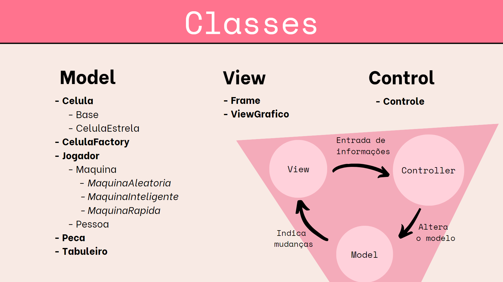

# Apresentação do Projeto

# Projeto `Super Ludo`

# Descrição Resumida do Projeto/Jogo

> Trata-se de uma adaptação do jogo Ludo, com alguns incrementos. O objetivo é dar a volta no tabuleiro com todas suas 4 peças, movimentando-as de acordo com o número dos dados. A dificuldade encontra-se que se uma peça adversária cair na mesma célula que a sua, sua peça é comida e deve retornar a base, recomeçando todo o percurso. Analogamente, você também pode comer peças inimigas. Pode-se jogar com os amigos de 2, 3 ou 4 pessoas, ou também pode-se jogar contra algum dos bots (aleatório, rápido, inteligente). Ganha quem completar o objetivo primeiro. Mais detalhes das regras do jogo ou do funcionamento dos bots pode ser encontrado [aqui](src/README.md).

# Equipe
* `Clara Mattos Medeiros` - `247021`
* `Isabella Ribeiro Rigue` - `234618`

# Arquivo Executável do Jogo

> [Download do arquivo `jar`](https://drive.google.com/drive/folders/1vZNI6-ut1LBfrGpc2ON8SOH63SQvFVtF?usp=sharing)
> 
obs: 
> - rodar o executável na mesma pasta que a pasta assets
> - há um executável específico para os sistemas Linux, pois nesse caso o caminho das imagens deve ser alterado no código (de '\\' para '//') nas classes Peca e ViewGrafico

# Slides do Projeto

## Slides da Prévia
> [Proposta inicial do jogo](https://docs.google.com/presentation/d/12rV_AdN4QFR2ecZaUHOLwGJCzaUigwPXL5O03V0YcQ4/edit#slide=id.p)

## Slides da Apresentação Final
> [Apresentação Final](https://www.canva.com/design/DAFE2J06abs/lrU3FeykeHoHeoiFLIUH_Q/view?utm_content=DAFE2J06abs&utm_campaign=designshare&utm_medium=link&utm_source=publishsharelink)

## Relatório de Evolução

> Relatório de evolução, descrevendo as evoluções do design do projeto, dificuldades enfrentadas, mudanças de rumo, melhorias e lições aprendidas. Referências aos diagramas e recortes de mudanças são bem-vindos.

# Destaques de Código

> Escolha trechos relevantes e/ou de destaque do seu código. Apresente um recorte (você pode usar reticências para remover partes menos importantes). Veja como foi usado o highlight de Java para o código.

~~~java
// Recorte do seu código
public void algoInteressante(…) {
   …
   trechoInteressante = 100;
}
~~~

# Destaques de Orientação a Objetos
> Destaque partes do código em que a orientação a objetos foi aplicada para aprimorar seu código. Por exemplo, o uso de polimorfismo para ajustar ações conforme o contexto. Sugestão de estrutura:

# Conexões
## Diagrama de Classes usada no destaque OO:
> Sugere-se um diagrama de classes para o destaque, mas podem ser usados outros tipos de diagrama, conforme a necessidade.

## Código do Destaque OO
~~~java
public class Tabuleiro {
	private Celula[][] celulas;
	private ViewGrafico view;

    ...

	public void conectaView(ViewGrafico view) {
		this.view = view;
	}

	public ViewGrafico getView() {
		return view;
	}
}
~~~

> explicação

# Encapsulamento
## Diagrama de Classes usada no destaque OO:
> Sugere-se um diagrama de classes para o destaque, mas podem ser usados outros tipos de diagrama, conforme a necessidade.

## Código do Destaque OO
~~~java
public class Peca extends JPanel implements Observed{
	private Tabuleiro tabuleiro;
	private boolean ganhou;
	private Image imagem;

    ...

	public Tabuleiro getTabuleiro() {
		return tabuleiro;
	}
	
	public Image getImage() {
		return imagem;
	}

	public boolean getGanhou() {
		return ganhou;
	}

	public void setGanhou(boolean ganhou) {
		this.ganhou = ganhou;
	}
}
~~~

> explicação

# Sobrecarga de métodos
## Diagrama de Classes usada no destaque OO:
> Sugere-se um diagrama de classes para o destaque, mas podem ser usados outros tipos de diagrama, conforme a necessidade.

## Código do Destaque OO
~~~java
public void atualizarView() { 
    //funcao para atualizar o view do dado qnd mudar o numero 
    view.updateUI();
}

public void atualizarView(Peca peca, int x, int y) {
    //funcao para atualizar o view qnd acontecer algum movimento da peca
    peca.update(x, y);
}
~~~

> explicação

# Herança e sobreposição
## Diagrama de Classes usada no destaque OO:
> Sugere-se um diagrama de classes para o destaque, mas podem ser usados outros tipos de diagrama, conforme a necessidade.

## Código do Destaque OO
~~~java
public class Pessoa extends Jogador{
	private int option;

	public Pessoa(String cor, Tabuleiro tabuleiro) {
		super(cor, tabuleiro);
	}

	public void fazerJogada(int numDado) {
		super.fazerJogada(numDado);
    ...
		int size = pecasDisponiveis.size();
		this.option = 0; 

		if(size == 0) {
			String[] options = {"Continuar"};
    ...
    }
}
~~~
~~~java
public class MaquinaRapida extends Maquina{

    public MaquinaRapida(String cor, Tabuleiro tabuleiro) {
		super(cor, tabuleiro);
	}

    public void fazerJogada(int numDado) { 
        super.fazerJogada(numDado);
        if (qtdPecasDisponiveis != 0) { 
            mover(pecasDisponiveis.get(0), numDado);
        } else if (numDado == 1 || numDado == 6){
            mover(pecasBase.get(0), numDado);
        }
    }
}
~~~

> explicação

# Polimorfismo
## Diagrama de Classes usada no destaque OO:
> Sugere-se um diagrama de classes para o destaque, mas podem ser usados outros tipos de diagrama, conforme a necessidade.

## Código do Destaque OO
~~~java
public class Controle {
	private Jogador jogador1, jogador2, jogador3, jogador4;
    ...
	public void criaJogadores() {
		if(modo == 1) {
			jogador1 = new Pessoa(corSelecionada(1), tabuleiro);
			jogadores.add(jogador1);
			if(bot == 0)
				jogador2 = new MaquinaAleatoria(corSelecionada(2), tabuleiro);
        ...
    }
}
~~~

> explicação

# Destaques de Pattern
> Os padrões de projeto adotados pela equipe foram:

# Singleton
## Diagrama do Pattern
> Diagrama do pattern dentro do contexto da aplicação.

## Código do Pattern
~~~java
public class Tabuleiro {
	private Celula[][] celulas;
	private ViewGrafico view;
	private int numDado; 
	private static final Tabuleiro instance = new Tabuleiro();

	private Tabuleiro() {
        ...
	}
	
	public static Tabuleiro getInstance() {
		return instance;
	}
}
~~~

> Explicação de como o pattern foi adotado e quais suas vantagens, referenciando o diagrama.

# Observer
## Diagrama do Pattern
> Diagrama do pattern dentro do contexto da aplicação.

## Código do Pattern
~~~java
public interface Observed {
    public void registrar(Observer obj);
    public void notificarObservadores();
}
~~~
~~~java
public interface Observer {
    public void update();
}
~~~
~~~java
public class Peca extends JPanel implements Observed {
    ...
	public void registrar(Observer obj) {
		if(!observers.contains(obj)) observers.add(obj);
	}

	public void notificarObservadores() {
		for (Observer obj : this.observers) {
			obj.update();
		}
	}
}
~~~
~~~java
public class ViewGrafico extends JPanel implements Observer {
    ...
    public void update() {
        updateUI();
        try {
            Thread.sleep(200);
        } catch(InterruptedException e) {};
    }
}
~~~

> Explicação de como o pattern foi adotado e quais suas vantagens, referenciando o diagrama.

# Factory
## Diagrama do Pattern
> Diagrama do pattern dentro do contexto da aplicação.

## Código do Pattern
~~~java
public class CelulaFactory {
    public static Celula criarCelula(int i, int j) {
        Celula celula;
        if(i >= 2 && i <= 3 && j >= 2 && j <= 3) {
            celula = new Base("vermelho", i, j);
            celula.definirProxima(6, 1);
        } else if(i >= 2 && i <= 3 && j >= 11 && j <= 12) {
            celula = new Base("verde", i, j);
            celula.definirProxima(1, 8);
    ...
        } else if(i == 6 && (j <= 5 || j >= 9)) {
            if (j == 1)
                celula = new CelulaEstrela(i, j, "vermelho");
            else
                celula = new Celula("null", i, j);
    ...

        return celula;
    }
}
~~~

> Explicação de como o pattern foi adotado e quais suas vantagens, referenciando o diagrama.

# Conclusões e Trabalhos Futuros

> Apresente aqui as conclusões do projeto e propostas de trabalho futuro. Esta é a oportunidade em que você pode indicar melhorias no projeto a partir de lições aprendidas e conhecimentos adquiridos durante a realização do projeto, mas que não puderam ser implementadas por questões de tempo. Por exemplo, há design patterns aprendidos no final do curso que provavelmente não puderam ser implementados no jogo -- este é o espaço onde você pode apresentar como aplicaria o pattern no futuro para melhorar o jogo.

# Diagramas

## Diagrama Geral da Arquitetura do Jogo

> Utilizamos a arquitetura MVC (Model View Controller), com as classes representadas acima. Podem existir alguns tipos de célula, desde a célula "normal" até algumas com mais incrementos, logo base e célula estrela são herdeiras de célula. No jogo, podemos ter como jogador uma pessoa ou uma máquina, e caso seja uma máquina ela pode ser de 3 tipos, apesar de semelhantes (todos são jogadores) há particularidades de cada um; assim pessoa e máquina são herdeiras de jogador, e máquina aleatória, máquina rápida e máquina inteligente são herdeiras de máquina. Além dessas, também há outras classes constituindo o Model, como visto acima, já no View as classes estão relacionadas com a interface gráfica, e por fim no Controller temos apenas o controle. Dessa forma, o controle recebe uma entrada de informações pela View, então ele atualiza o Model, e o Model indica mudanças para View, dizendo para ela atualizar.
> 
> Já na parte de conexões, temos que, independente de ser uma pessoa ou máquina, sempre vão ter 4 peças, logo cada pessoa ou máquina está conectada com 4 peças. Indo para o lado esquerdo do diagrama, vemos que o tabuleiro está conectado com todas suas células, podendo ser célula normal, base ou estrela. Já as células estão conectadas com o que está nela no momento, por exemplo, se houver uma peça naquela posição, a célula estará conectada com ela. Além disso, cada célula também está conectada com sua próxima célula (de acordo com o trajeto que a peça deve seguir no tabuleiro), dessa maneira quando a peça for andar de uma célula a outra, ela já saberá para onde ir. Outrossim, cada peça está conectada com o tabuleiro, que por sua vez está conectado com a view, e esta está conectada com o controle (conexões para o MVC). Por fim, podem existir no máximo 4 jogadores, portanto, o controle pode estar conectado com no mínimo 2 e no máximo 4 jogadores.

## Detalhamento das Interfaces

### Interface `<nome da interface>`

`<Resumo do papel da interface.>`

~~~
<Interface em Java.>
~~~

Método | Objetivo
-------| --------
`<id do método em Java>` | `<objetivo do método e descrição dos parâmetros>`

## Exemplo:

### Interface `ITableProducer`

Interface provida por qualquer fonte de dados que os forneça na forma de uma tabela.

~~~java
public interface ITableProducer {
  String[] requestAttributes();
  String[][] requestInstances();
}
~~~

Método | Objetivo
-------| --------
`requestAttributes` | Retorna um vetor com o nome de todos os atributos (colunas) da tabela.
`requestInstances` | Retorna uma matriz em que cada linha representa uma instância e cada coluna o valor do respectivo atributo (a ordem dos atributos é a mesma daquela fornecida por `requestAttributes`.

### Interface `IDataSetProperties`

Define o recurso (usualmente o caminho para um arquivo em disco) que é a fonte de dados.

~~~java
public interface IDataSetProperties {
  public String getDataSource();
  public void setDataSource(String dataSource);
}
~~~

Método | Objetivo
-------| --------
`getDataSource` | Retorna o caminho da fonte de dados.
`setDataSource` | Define o caminho da fonte de dados, informado através do parâmetro `dataSource`.

# Plano de Exceções

> A OpcaoVaziaException é uma exceção checked, de modo que deve ser tratada no código. Basicamente, essas execeções são geradas quando o jogador não seleciona uma opção e tenta continuar com o jogo, o que não é possível. Assim, é lançada uma execeção que o obriga a escolher uma opção ou a fechar o jogo, sendo personalizada para cada caso.

## Diagrama da hierarquia de exceções

## Descrição das classes de exceção

Classe | Descrição
----- | -----
OpcaoVaziaException | Engloba todas as exceções de opções não selecionadas (vazias).
OpcaoVaziaPecaException | Engloba apenas as exceções de opções não selecionadas para as peças.
OpcaoVaziaBotException | Engloba apenas as exceções de opções não selecionadas para a escolha dos bots.
OpcaoVaziaQtdJogadoresException | Engloba apenas as exceções de opções não selecionadas para a escolha da quantidade de jogadores.
